# SIGITA

Welcome to the SIGITA system management project repository! This repository contains the code related to the Software Development first course final project.

## Project Description

The objective of this project was to develop a system management desktop application for a local grocery store business. The project involved the application of all stages of the software development life cycle using the Scrum agile methodology.

### 👀 Take a look at the GUI!

| Login page                    | Home page                     |
| ----------------------------- | ----------------------------- |
| 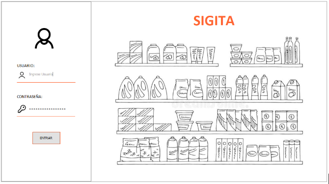 | 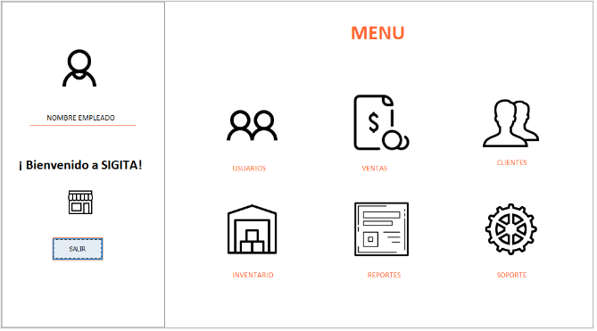 |

## Modules

### Customer Management

    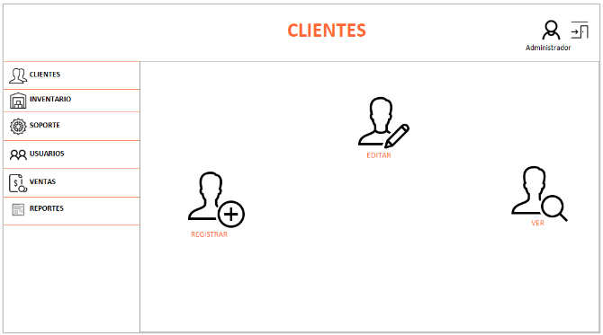

💻[modelo](src/modeloGestionCliente) &nbsp 🎨[vista](src/vistaGestionCliente) &nbsp 🛠️[controlador](src/controladorGestionCliente) &nbsp 🗄️[conexionBD](src/conexionBDGestionCliente) &nbsp 🧪[tests](test/modeloGestionCliente)

### User Management

    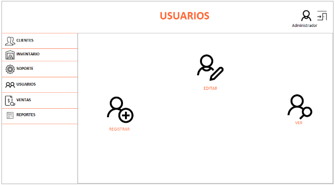

- [modelo](src/modeloGestionUsuario)
- [vista](src/vistaGestionUsuario)
- [controlador](src/controladorGestionUsuario)
- [conexionBD](src/conexionBDGestionUsuario)
- [tests](test/modeloGestionUsuario)

### Report Management

    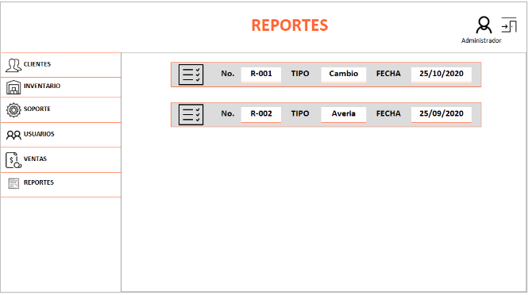

- [modelo](src/modeloGestionReporte)
- [vista](src/vistaGestionReporte)
- [controlador](src/controladorGestionReporte)
- [conexionBD](src/conexionBDGestionReporte)
- [tests](test/modeloGestionReporte)

### Inventoy Management

    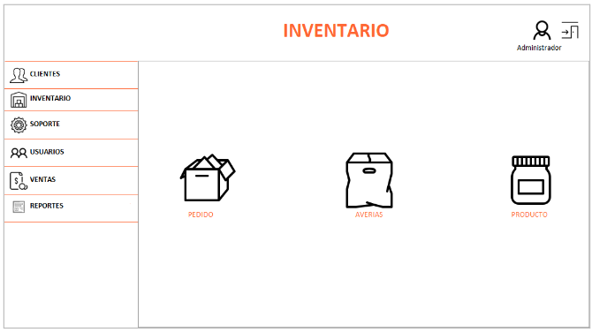

- [modelo](src/modeloGestionInventario)
- [vista](src/vistaGestionInventario)
- [controlador](src/controladorGestionInventario)
- [conexionBD](src/conexionBDGestionInventario)
- [tests](test/modeloGestionInventario)

### Sales Management

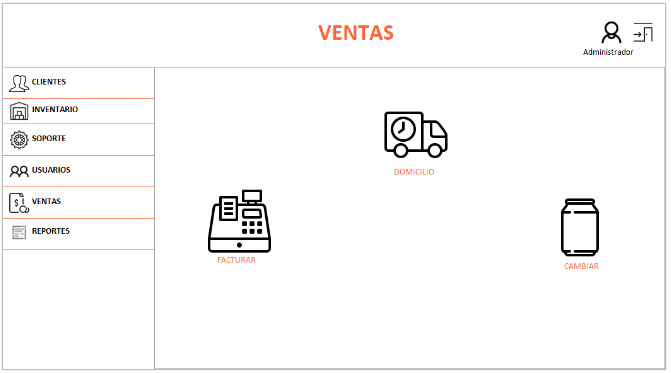

- [modelo](src/modeloGestionVenta)
- [vista](src/vistaGestionVenta)
- [controlador](src/controladorGestionVenta)
- [conexionBD](src/conexionBDGestionVenta)
- [tests](test/modeloGestionVenta)

### Delivey Management

    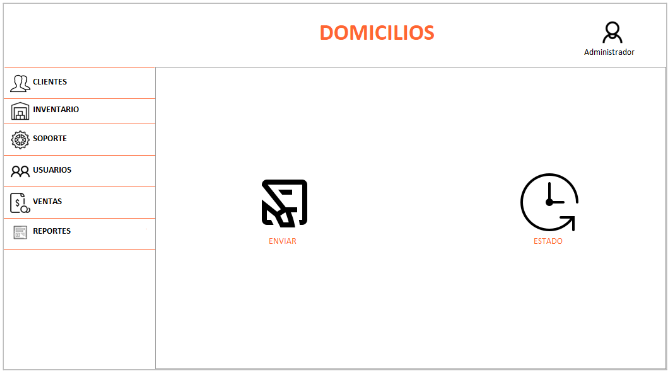

- [vista](src/vistaGestionDomicilio)

### Pop-ups

| Pop-up 1                           | Pop-up 2                           | Pop-up 3                           |
| ---------------------------------- | ---------------------------------- | ---------------------------------- |
| 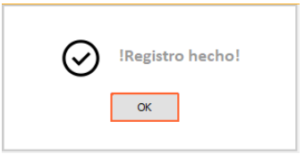 | 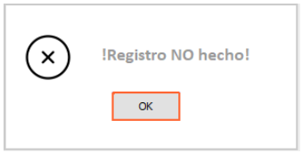 | 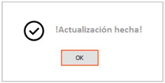 |

| Pop-up 4                           | Pop-up 5                           |
| ---------------------------------- | ---------------------------------- |
| 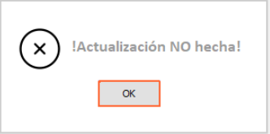 | 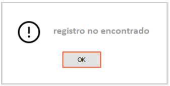 |

- [vista](src/vistaMensEmerg)

## ⚠️Caution

An entire refactoring is needed in order to update the tech stack and improve the scope of the application.

Note: This will be done progressively.
